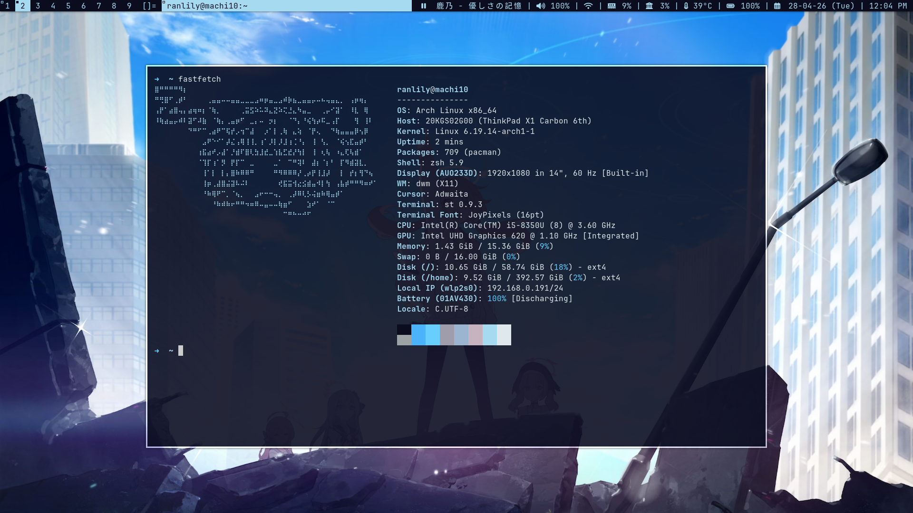

# dwm
my own build of DWM
# patches
- actualfullscreen
- center
- floatrules
- fullgaps
- movecenter
- statuscmd
- xrdb
# Dependencies
- For Arch:
   
  ```
  sudo pacman -S base-devel xorg-server xorg-xinit libx11 libxinerama libxft webkit2gtk
  ```
# Screenshots

